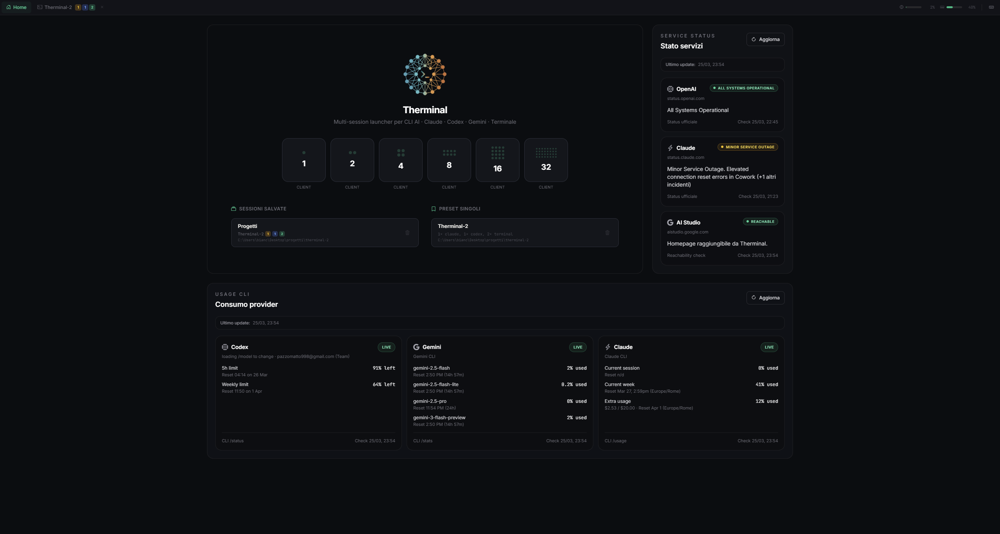
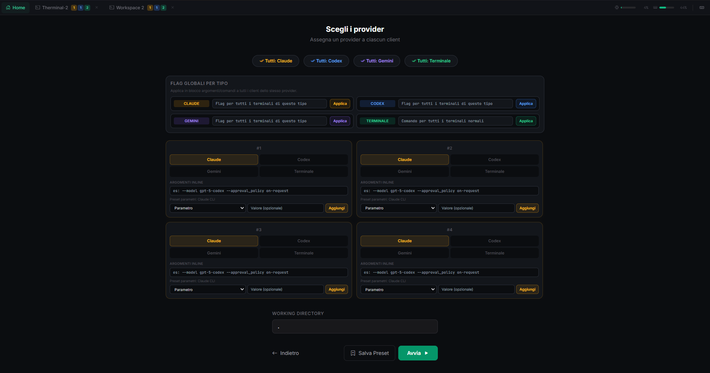
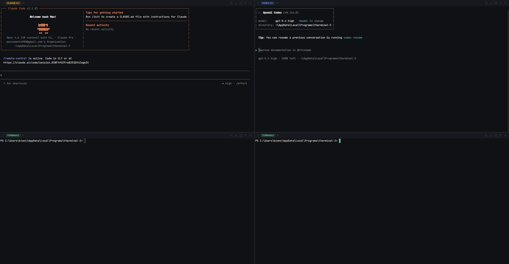

# Therminal

Launcher desktop per gestire piu sessioni CLI AI in parallelo da un'unica interfaccia Windows.

Therminal usa terminali embedded con `xterm.js`, workspace ridimensionabili, preset, sessioni salvate, stato servizi e pannello usage per `Claude`, `Codex`, `Gemini` e terminali generici.

## Screenshot



| Home | Workspace |
| --- | --- |
|  |  |

| Sessioni live | Focus terminale |
| --- | --- |
|  |  |

## Cosa fa

- Avvia 1, 2, 4, 8, 16 o 32 client in parallelo.
- Mescola provider diversi nello stesso workspace.
- Usa terminali embedded ridimensionabili con drag tra pannelli.
- Salva preset singoli e sessioni complete da ripristinare dopo.
- Supporta `working directory` manuale o tramite selettore cartelle.
- Mostra usage summary dei provider supportati.
- Mostra stato servizi esterni direttamente nella home.
- Supporta broadcast verso tutti i terminali aperti.
- Rileva automaticamente se i CLI richiesti sono installati e li disabilita se mancanti.

## Provider supportati

- `Claude CLI`
- `Codex CLI`
- `Gemini CLI`
- `Terminale` generico

Non e necessario avere tutti i CLI installati. Therminal controlla quali binari sono disponibili nel `PATH`:

- i provider disponibili sono selezionabili normalmente
- i provider mancanti vengono segnalati come warning
- il terminale generico resta utilizzabile anche senza CLI AI installati

## Requisiti

### Per usare l'app da installer `.exe`

- Windows 10 o Windows 11
- i CLI che vuoi usare realmente installati nel `PATH`

### Per sviluppo locale

- Windows 10 o Windows 11
- Node.js LTS
- npm
- Visual Studio Build Tools se devi ricompilare `node-pty`

## Avvio rapido

```bash
npm install
npm start
```

Comandi utili:

```bash
npm run dev
npm run rebuild-pty
npm run build
```

## Build dell'installer

Per generare il pacchetto Windows:

```bash
npm run build
```

L'output viene scritto in `dist/`.

## Uso

1. Apri Therminal.
2. Scegli quanti client vuoi avviare.
3. Seleziona il provider per ogni terminale.
4. Inserisci eventuali flag inline o comandi custom.
5. Imposta la `working directory` scrivendo il path oppure usando `Sfoglia`.
6. Avvia il workspace.
7. Salva preset o l'intera sessione se vuoi riutilizzarla.

## Scorciatoie

- `Ctrl + /`: apre la modale informazioni e scorciatoie
- `Ctrl + Shift + B`: attiva il broadcast verso tutti i terminali
- `Ctrl + -`: riduce il font
- `Ctrl + =`: aumenta il font
- `Esc`: chiude modali e broadcast bar quando aperti

## Funzioni principali dell'interfaccia

### Home

- launcher rapido dei workspace
- elenco preset salvati
- elenco sessioni salvate
- stato servizi
- pannello usage dei provider
- warning sui CLI mancanti con refresh del rilevamento

### Workspace

- tab multipli
- drag & drop dei pannelli
- resize righe e colonne
- ricerca nel buffer
- export log `.log` o `.txt`
- restart singola sessione
- massimizzazione del terminale

### Modale info

- riepilogo scorciatoie
- descrizione funzioni principali
- stato del rilevamento provider anche se il banner home e stato chiuso

## Struttura del progetto

```text
main.js                Electron main process
preload.js             bridge sicuro renderer <-> main
src/index.html         shell UI principale
src/renderer.js        bootstrap del renderer
src/modules/           moduli UI e logica applicativa
after-pack.js          hook di packaging
build.bat              build end-to-end su Windows
```

## Note sui CLI mancanti

Se `claude`, `codex` o `gemini` non sono installati:

- Therminal non prova ad avviare sessioni invalide
- il provider viene mostrato come non disponibile
- puoi aggiornare il rilevamento dalla home o dalla modale scorciatoie

## Risoluzione problemi

### `node-pty` non si carica

Dopo upgrade di Electron o su ambienti Windows nuovi:

```bash
npm run rebuild-pty
```

### Un provider risulta mancante ma e installato

Controlla che il comando sia disponibile nel `PATH` del sistema che lancia l'app:

```powershell
where.exe claude
where.exe codex
where.exe gemini
```

Poi usa `Rileva di nuovo` nell'app.

### La cartella di lavoro non viene trovata

Usa il selettore `Sfoglia` oppure verifica che il path inserito esista davvero sul filesystem locale.

## Stack

- Electron
- node-pty
- xterm.js
- @xterm/addon-fit
- @xterm/addon-search
- @xterm/addon-web-links

## Licenza

MIT
